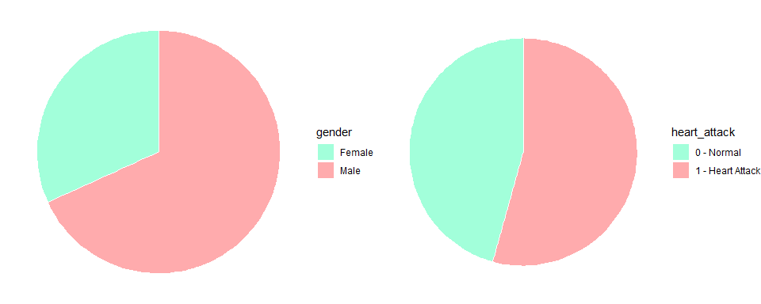
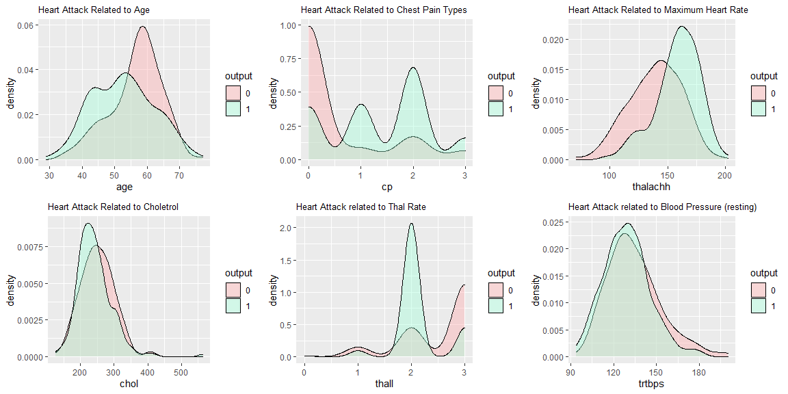
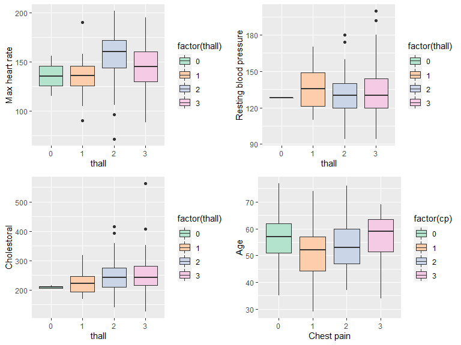
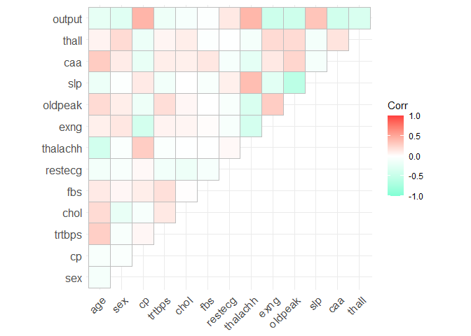
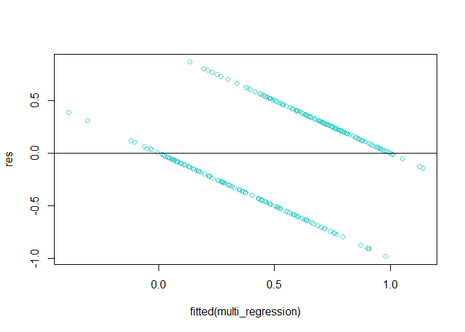

Final Project - Intro to Statistics and Data Analysis
================
Tomer Blum and Noa Shapira
June 2021

<body style="background-color:lavender;">


## Introduction

In this project we analyzed a data set containing 13 features and 300
samples regarding heart attack probability. <br>We will use different
methods we learned in the course by examining the relations between
different features from the data set. <br>The goal of our project is to
demonstrate and practice the different elements we have learned.

**Variables we focused on:** <br>1. Chest pain <br>2. Maximum heart rate
<br>3. The slope of the peak exercise ST segment <br>4. ST depression
induced by exercise relative to rest <br>5. diagnosis of heart disease
(angiographic disease status) in any major vessel <br>6. Gender of the
person

**Methods we used:** <br>1. Multiple linear regression. <br>2.
Hypothesis test: F-test for variances and T-test for means.

## Data Import

First, we read the heart attack file

``` r
heart_attack <- read.csv("heart.csv")
```

## Data Tidying

Now, we will get a glimpse of the data set

``` r
glimpse(heart_attack)
```

    ## Rows: 303
    ## Columns: 14
    ## $ age      <int> 63, 37, 41, 56, 57, 57, 56, 44, 52, 57, 54, 48, 49, 64, 58, 5~
    ## $ sex      <int> 1, 1, 0, 1, 0, 1, 0, 1, 1, 1, 1, 0, 1, 1, 0, 0, 0, 0, 1, 0, 1~
    ## $ cp       <int> 3, 2, 1, 1, 0, 0, 1, 1, 2, 2, 0, 2, 1, 3, 3, 2, 2, 3, 0, 3, 0~
    ## $ trtbps   <int> 145, 130, 130, 120, 120, 140, 140, 120, 172, 150, 140, 130, 1~
    ## $ chol     <int> 233, 250, 204, 236, 354, 192, 294, 263, 199, 168, 239, 275, 2~
    ## $ fbs      <int> 1, 0, 0, 0, 0, 0, 0, 0, 1, 0, 0, 0, 0, 0, 1, 0, 0, 0, 0, 0, 0~
    ## $ restecg  <int> 0, 1, 0, 1, 1, 1, 0, 1, 1, 1, 1, 1, 1, 0, 0, 1, 1, 1, 1, 1, 1~
    ## $ thalachh <int> 150, 187, 172, 178, 163, 148, 153, 173, 162, 174, 160, 139, 1~
    ## $ exng     <int> 0, 0, 0, 0, 1, 0, 0, 0, 0, 0, 0, 0, 0, 1, 0, 0, 0, 0, 0, 0, 0~
    ## $ oldpeak  <dbl> 2.3, 3.5, 1.4, 0.8, 0.6, 0.4, 1.3, 0.0, 0.5, 1.6, 1.2, 0.2, 0~
    ## $ slp      <int> 0, 0, 2, 2, 2, 1, 1, 2, 2, 2, 2, 2, 2, 1, 2, 1, 2, 0, 2, 2, 1~
    ## $ caa      <int> 0, 0, 0, 0, 0, 0, 0, 0, 0, 0, 0, 0, 0, 0, 0, 0, 0, 0, 0, 2, 0~
    ## $ thall    <int> 1, 2, 2, 2, 2, 1, 2, 3, 3, 2, 2, 2, 2, 2, 2, 2, 2, 2, 2, 2, 3~
    ## $ output   <int> 1, 1, 1, 1, 1, 1, 1, 1, 1, 1, 1, 1, 1, 1, 1, 1, 1, 1, 1, 1, 1~

We would like our data to be unique, so we will remove identical rows

``` r
get_duplicates <- function(df){
    total_rows = dim(df)[1]
    unique_rows = dim(df %>% group_by_all %>% count)[1]
    n_duplicates = (total_rows - unique_rows)
    cat('n duplicates -> ', n_duplicates)
}

get_duplicates(heart_attack)
```

    ## n duplicates ->  1

``` r
heart_attack = unique(heart_attack)
get_duplicates(heart_attack)
```

    ## n duplicates ->  0

<html>
<head>
<style>
table {
  font-family: arial, sans-serif;
  border-collapse: collapse;
  width: 100%;
}

td, th {
  border: 1px solid #79C4BE;
  text-align: left;
  padding: 8px;
}

tr:nth-child(even) {

}
</style>
</head>
<body>
<h2>
Variable Description
</h2>
<table>
<tr style="background-color:#79C4BE">
<th>
Variable
</th>
<th>
Class
</th>
<th>
Description
</th>
</tr>
<tr>
<td>
age
</td>
<td>
int
</td>
<td>
Age of the person (in years)
</td>
</tr>
<tr>
<td>
sex
</td>
<td>
bool
</td>
<td>
Gender of the person (1-male, 0-female)
</td>
</tr>
<tr>
<td>
cp
</td>
<td>
categorical
</td>
<td>
Chest Pain type: 1-typical angina, 2-atypical angina, 3-non-anginal
pain, 4-asymptomatic
</td>
</tr>
<tr>
<td>
trtbps
</td>
<td>
int
</td>
<td>
resting blood pressure (in mm Hg on admission to the hospital)
</td>
</tr>
<tr>
<td>
chol
</td>
<td>
int
</td>
<td>
cholestoral in mg/dl
</td>
</tr>
<tr>
<td>
fbs
</td>
<td>
bool
</td>
<td>
fasting blood sugar &gt; 120 mg/dl (1-true; 0-false)
</td>
</tr>
<tr>
<td>
restecg
</td>
<td>
categorical
</td>
<td>
resting electrocardiographic results: 0-normal, 1-having ST-T wave
abnormality (T wave inversions and/or ST elevation or depression of &gt;
0.05 mV), 2-showing probable or definite left ventricular hypertrophy by
Estes’ criteria
</td>
</tr>
<tr>
<td>
thalachh
</td>
<td>
int
</td>
<td>
maximum heart rate achieved
</td>
</tr>
<tr>
<td>
exng
</td>
<td>
bool
</td>
<td>
exercise induced angina (1-yes, 0-no)
</td>
</tr>
<tr>
<td>
oldpeak
</td>
<td>
int
</td>
<td>
ST depression induced by exercise relative to rest
</td>
</tr>
<tr>
<td>
slp
</td>
<td>
categorical
</td>
<td>
the slope of the peak exercise ST segment: 1-upsloping, 2-flat,
3-downsloping
</td>
</tr>
<tr>
<td>
caa
</td>
<td>
int
</td>
<td>
number of major vessels (0-3)
</td>
</tr>
<tr>
<td>
thall
</td>
<td>
int
</td>
<td>
Thal rate: 3-normal; 6-fixed defect; 7-reversable defect
</td>
</tr>
<tr>
<td>
output
</td>
<td>
bool
</td>
<td>
diagnosis of heart disease (angiographic disease status) in any major
vessel <br>Value 0: &lt; 50% diameter narrowing <br>Value 1: &gt; 50%
diameter narrowing
</td>
</tr>
</table>
</body>
</html>

<br> We will check if there are NaN values in our data set

``` r
colSums(is.na(heart_attack))
```

    ##      age      sex       cp   trtbps     chol      fbs  restecg thalachh 
    ##        0        0        0        0        0        0        0        0 
    ##     exng  oldpeak      slp      caa    thall   output 
    ##        0        0        0        0        0        0

As we see above, there are no NaN values.

## Understanding the data

## Transforming variables

Our data including only numerical values, so currently, we won’t need
any further pre-processing. We believe that some of the values are
categorical, where each number presents different category. In the
visualization step, we will try to verify our assumption by plotting
each feature and seeing it’s distribution.

## Visualizing

``` r
ggplot(gather(heart_attack), aes(value)) + geom_histogram(bins = 10, fill = "mediumturquoise") + facet_wrap(~key, scales = 'free', ncol = 4)
```

<!-- --> <br> <br>Now,
we can clearly see the difference between categorical features and
numerical ones: <br>**Numerical Features:** `age`, `chol`, `oldpeak`,
`thalachh` and `trtbps`. <br>**Categorical Features:** `caa`, `cp`,
`exng`, `fbs`, `restecg`, `sex`, `slp`,`output` and `thall`.

<br> We can see that `age`, `chol`, `thalachh` and `trtbps` seem to
distribute normally, in order to assure that we will plot QQplot graphs.
If a variable distributes normally, we will see diagonal line.

``` r
age_qq <- ggplot(heart_attack, aes(sample = age)) + geom_qq(color = "mediumturquoise") + geom_qq_line(col = "red") + labs(x = "Age")
trtbps_qq <- ggplot(heart_attack, aes(sample = trtbps)) + geom_qq(color = "mediumturquoise") + geom_qq_line(col = "red") + labs(x = "Resting blood pressure")
chol_qq <- ggplot(heart_attack, aes(sample = chol)) + geom_qq(color = "mediumturquoise") + geom_qq_line(col = "red") + labs(x = "Cholestoral")
thalachh_qq <- ggplot(heart_attack, aes(sample = thalachh)) + geom_qq(color = "mediumturquoise") + geom_qq_line(col = "red") + labs(x = "Maximum heart rate")

grid.arrange(age_qq, trtbps_qq, chol_qq, thalachh_qq, ncol = 2)
```

<!-- -->
<br> <br>All the features except Resting blood pressure (trtbps) appear
to distribute normally.

<br> Now we will plot pie chart for the features `heart_attack` and
`gender`

``` r
make_string = function(bool_var){
  char_list = c(1, length(bool_var))
  for (i in 1:length(bool_var)) {
    var = bool_var[i]
    new_char = 'unknown'  
    
    if(var == 1){
        new_char = 'Male'
    }
    else{
        new_char = 'Female'
     }
      
     char_list[i] =  new_char
   }
    
    return(char_list)
 }

gender_df <- heart_attack %>% 
    select(sex) %>%
    group_by(sex) %>%
    summarise(Count = n()) %>%
    arrange(desc(Count)) %>%
    mutate(
        gender = make_string(sex),
        percentage = paste0(round(Count / sum(Count) * 100, 1), "%")
    )

plot01 <- ggplot(gender_df, aes(x = "", y = Count, fill = gender )) + geom_bar(stat="identity", width=1, color="white") +  coord_polar("y", start=0) + theme_void() + scale_fill_manual(values=c("#A2FFDA", "#FFABAD"))
make_string_heart = function(bool_var){
  char_list = c(1, length(bool_var))
  for (i in 1:length(bool_var)) {
    var = bool_var[i]
    new_char = 'unknown'  

    if(var == 0){
        new_char = '0 - Normal'
     }
      
    if(var == 1){
        new_char = '1 - Heart Attack'
    }
      
     char_list[i] =  new_char
   }
    
    return(char_list)
 }

output_df <- heart_attack %>% 
    select(output) %>%
    group_by(output) %>%
    summarise(Count = n()) %>%
    arrange(desc(Count)) %>%
    mutate(
        heart_attack = make_string_heart(output),
        percentage = paste0(round(Count / sum(Count) * 100, 1), "%")
    )

plot02 <- ggplot(output_df, aes(x = "", y = Count, fill = heart_attack )) + geom_bar(stat="identity", width=1, color="white") +  coord_polar("y", start=0) + theme_void() + scale_fill_manual(values=c("#A2FFDA", "#FFABAD"))
grid.arrange(plot01, plot02, ncol = 2) 
```

<!-- -->

``` r
heart_attack_mod <- heart_attack %>%
  mutate(output = as.factor(output))

plot1 <- ggplot(heart_attack_mod,aes(x = age, fill = output)) + geom_density(alpha = 0.4) + ggtitle("Heart Attack Related to Age") + theme(plot.title = element_text(size = 10) ) + scale_fill_manual(values=c("#FFABAD","#A2FFDA"))
plot2 <-ggplot(heart_attack_mod,aes(x = cp, fill = output)) + geom_density(alpha = 0.4) + ggtitle("Heart Attack Related to Chest Pain Types") + theme(plot.title = element_text(size = 10) ) + scale_fill_manual(values=c("#FFABAD","#A2FFDA"))
plot3 <-ggplot(heart_attack_mod,aes(x = thalachh, fill = output)) + geom_density(alpha = 0.4) + ggtitle("Heart Attack Related to Maximum Heart Rate") + theme(plot.title = element_text(size = 10) ) + scale_fill_manual(values=c("#FFABAD","#A2FFDA"))
plot4 <-ggplot(heart_attack_mod,aes(x = chol, fill = output)) + geom_density(alpha = 0.4) + ggtitle("Heart Attack Related to Choletrol") + theme(plot.title = element_text(size = 10) ) + scale_fill_manual(values=c("#FFABAD","#A2FFDA"))
plot5 <-ggplot(heart_attack_mod,aes(x = thall, fill = output)) + geom_density(alpha = 0.4) + ggtitle("Heart Attack related to Thal Rate") + theme(plot.title = element_text(size = 10) ) + scale_fill_manual(values=c("#FFABAD","#A2FFDA"))
plot6 <-ggplot(heart_attack_mod,aes(x = trtbps, fill = output)) + geom_density(alpha = 0.4) + ggtitle("Heart Attack related to Blood Pressure (resting)") + theme(plot.title = element_text(size = 10) ) + scale_fill_manual(values=c("#FFABAD","#A2FFDA"))

grid.arrange(plot1, plot2, plot3, plot4, plot5, plot6, ncol = 3)
```

<!-- --> <br>
**Interpretations from the above density plots:** <br>-Most people that
suffer from heart attacks are in the ages of 40-60 Years <br>-People
with higher chance to have heart attacks often suffer from Non Anginal
Pain, Type 1 or Type 2 Chest Pain. <br>-Large number of people who
suffer heart attacks have Max heart rates between 140-180 <br>-People
with Cholesterol Levels higher than 200mg/dL have higher chance to
suffer from heart attacks . <br>-More Heart Attacks were seen in people
with Thallium Stress Test value of 2

``` r
heart_attack %>% 
  filter(output == 1, sex == 0) %>%
  summarise(
    min = min(age),
    median = median(age),
    mean = mean(age),
    max = max(age)
  )
```

    ##   min median     mean max
    ## 1  34     54 54.55556  76

From the information above, we learn that for women in the dataset the
minimal age for heart attack risk is 34, the maximal age is 76, the
median age is 54 and the mean age is 54.5.

``` r
heart_attack %>% 
  filter(output == 1, sex == 1) %>%
  summarise(
    min = min(age),
    median = median(age),
    mean = mean(age),
    max = max(age)
  )
```

    ##   min median     mean max
    ## 1  29     52 51.04348  70

From the information above, we learn that for men in the dataset the
minimal age for heart attack risk is 29, the maximal age is 70, the
median age is 52 and the mean age is 51.04.

``` r
p1 <-ggplot(heart_attack, aes(x = factor(thall), y = thalachh, fill = factor(thall))) + geom_boxplot() + scale_fill_brewer(palette = "Pastel2") + xlab("thall") + ylab("Max heart rate") 
p2 <- ggplot(heart_attack, aes(x = factor(thall), y = trtbps, fill = factor(thall))) + geom_boxplot() + xlab("thall") + ylab("Resting blood pressure") + scale_fill_brewer(palette = "Pastel2")
p3 <- ggplot(heart_attack, aes(x = factor(thall), y = chol, fill = factor(thall))) + geom_boxplot() + xlab("thall") + ylab("Cholestoral") + scale_fill_brewer(palette = "Pastel2")
p4 <- ggplot(heart_attack, aes(x = factor(cp), y = age, fill = factor(cp))) + geom_boxplot() + xlab("Chest pain") + ylab("Age") + scale_fill_brewer(palette = "Pastel2")
grid.arrange(p1,p2,p3,p4,ncol = 2)
```

<!-- --> <br>
<br>**Conclusions from the boxplots above:** <br> -There are outliers in
the categorical data. <br> -We can see that people with Thallium Stress
Test Value of 2 have higher Max Heart Rates. <br> -Some people with
Thallium Stress Test Value of 1 have higher Resting Blood Pressure. <br>
-People with Thallium Stress Test with values of 2 and 3 tend to have
higher cholestoral levels. <br> -People older than 50 years tend to have
Anginal Pains. <br>

<br> In order to see the differences in maximum heart rate between males
and females, we will plot histograms for each one of them.

``` r
female_thalachh <- heart_attack %>%
  filter(sex == 0) %>%
  select(thalachh)
pl01 <- ggplot(female_thalachh, aes(thalachh)) + geom_histogram(bins = 20, fill = "mediumturquoise") + ggtitle("Female")

male_thalachh <- heart_attack %>%
  filter(sex == 1) %>%
  select(thalachh)
pl02 <- ggplot(male_thalachh, aes(thalachh)) + geom_histogram(bins = 20, fill = "mediumturquoise") + ggtitle("Male")
grid.arrange(pl01, pl02, ncol = 2)
```

<!-- -->
<br> We can see that the two plots aren’t identical, but seem similar
and share the same peak. <br> In addition, we can see that the
distributions are pretty normal.

## Modeling

### 1. Multi Linear Regression

<br>We will check the correlation between different features using a
hitmap:

``` r
heart_attack_corr <- cor(heart_attack)
ggcorrplot(heart_attack_corr, type = 'upper', hc.method = 'complete', colors = c("aquamarine", "white", "brown1") )
```

<!-- --> <br>We see some
positive correlation between `cp` & `output`, `thalachh` & `output` and
`thalachh` & `slp`. <br>we also see negative correlation between
`oldpeak` & `slp`.

<br> Building a multiple regression model with the variables: `output`
in relation to `thalachh`, `slp`, `oldpeak` and `cp`

``` r
multi_regression <- lm(output~thalachh + slp + oldpeak + cp,data = heart_attack)
summary(multi_regression)
```

    ## 
    ## Call:
    ## lm(formula = output ~ thalachh + slp + oldpeak + cp, data = heart_attack)
    ## 
    ## Residuals:
    ##     Min      1Q  Median      3Q     Max 
    ## -0.9806 -0.2795  0.0487  0.2925  0.8651 
    ## 
    ## Coefficients:
    ##              Estimate Std. Error t value Pr(>|t|)    
    ## (Intercept) -0.235312   0.175863  -1.338 0.181905    
    ## thalachh     0.004464   0.001143   3.904 0.000117 ***
    ## slp          0.057849   0.047196   1.226 0.221284    
    ## oldpeak     -0.116133   0.024633  -4.715 3.73e-06 ***
    ## cp           0.156627   0.023393   6.695 1.07e-10 ***
    ## ---
    ## Signif. codes:  0 '***' 0.001 '**' 0.01 '*' 0.05 '.' 0.1 ' ' 1
    ## 
    ## Residual standard error: 0.3998 on 297 degrees of freedom
    ## Multiple R-squared:  0.3666, Adjusted R-squared:  0.3581 
    ## F-statistic: 42.98 on 4 and 297 DF,  p-value: < 2.2e-16

*Y* =  − 0.235 + 0.004*X*<sub>1</sub> + 0.057*X*<sub>2</sub> − 0.116*X*<sub>3</sub> + 0.156*X*<sub>4</sub>

After looking at the model summary, we can see in the residuals section
that the median equals to 0.048, which is close to the mean (0), it
might help us later. <br> In addition, we can see that the adjusted R
squared is pretty low, which means the explained variance percentage is
low, and our model doesn’t fit to the data.

``` r
res <- resid(multi_regression)
plot(fitted(multi_regression), res, col = "mediumturquoise")
abline(0,0)
```

<!-- --> <br> The
x-axis displays the fitted values and the y-axis displays the residuals.
From the plot we can see that the spread of the residuals tends to be
heteroscedastic.

``` r
qqnorm(res, col = "mediumturquoise")
qqline(res) 
```

<!-- -->
<br> The residuals tend to stray from the line quite a bit near the
tails, which could indicate that they are not normally distributed.

``` r
plot(density(res), col = "darkcyan")
```

<!-- -->
<br> From the density residuals plot we can see that the residuals
doesn’t normally distributed.

<br> **Conclusions:** <br> - The residuals first plot shows us that the
residuals are heteroscedastic. <br> - The QQ and density plots shows
that the residuals aren’t normally distributed. <br> <br> **To
summarize, given the low R-squared, heteroscedastic residuals and the
problematic distribution of the residuals, we think the model is
unsuitable for the data.**

### 2. Hypothesis test

<br> We will use T-test to check if the mean of the maximum heart rate
is equal between male and female. In order to do so, we will first need
to check if the variance is equal, using F-test.

<br> First, we will plot boxplots of each group (females and males)

``` r
ggplot(heart_attack, aes(x = factor(sex), y = thalachh, fill = factor(sex))) + geom_boxplot() + scale_fill_manual(values=c("#FFABAD","#A2FFDA"))
```

<!-- -->
<br>**Assumptions:** <br>-The two samples are independent.  
-From the boxplots we can see that the male group distributes normally.
<br>-We will assume normality on the female distribution group.

<br>**Hypothesis:** <br>
<br>*H*<sub>0</sub> : *σ*<sub>*m*</sub><sup>2</sup> = *σ*<sub>*f*</sub><sup>2</sup>
<br>*H*<sub>1</sub> : *σ*<sub>*m*</sub><sup>2</sup> ≠ *σ*<sub>*f*</sub><sup>2</sup>

``` r
var.test(formula = thalachh ~ factor(sex), data = heart_attack)
```

    ## 
    ##  F test to compare two variances
    ## 
    ## data:  thalachh by factor(sex)
    ## F = 0.69022, num df = 95, denom df = 205, p-value = 0.0418
    ## alternative hypothesis: true ratio of variances is not equal to 1
    ## 95 percent confidence interval:
    ##  0.4939374 0.9861196
    ## sample estimates:
    ## ratio of variances 
    ##          0.6902214

Since our p value is smaller then 5% we reject the null hypothesis, the
variances are unequal.

<br>**Assumptions:** <br>-The two samples are independent.  
-From the boxplots we can see that the male group distributes normally.
<br>-We will assume normality on the female distribution group. <br>-The
variances are unequal.

<br>**Hypothesis:** <br>
<br>*H*<sub>0</sub> : *μ*<sub>*m*</sub> = *μ*<sub>*f*</sub>
<br>*H*<sub>1</sub> : *μ*<sub>*m*</sub> ≠ *μ*<sub>*f*</sub>

``` r
t.test(formula = thalachh ~ sex, data = heart_attack, alternative = "two.sided")
```

    ## 
    ##  Welch Two Sample t-test
    ## 
    ## data:  thalachh by sex
    ## t = 0.86106, df = 220.09, p-value = 0.3901
    ## alternative hypothesis: true difference in means is not equal to 0
    ## 95 percent confidence interval:
    ##  -2.938902  7.499582
    ## sample estimates:
    ## mean in group 0 mean in group 1 
    ##        151.1250        148.8447

The p-value of F-test is p = 0.39 which is greater than the significance
level 0.05. In conclusion, there is no significant difference between
the two means.

## Conclusions:

In this project we used different methods to manipulate the format data
and to visualize the different data set features using: <br>boxplots,
qqplots, density plots, piecharts. By that, we assumed different
hypotheses about our data, explored the effect of gender on different
aspects and tested relations between the different variables. <br>To
summarize, this project gave us a great opportunity to practice coding,
gain experience in data analysis and implement methods we’ve learned
during the course. <br> <br> <br>
